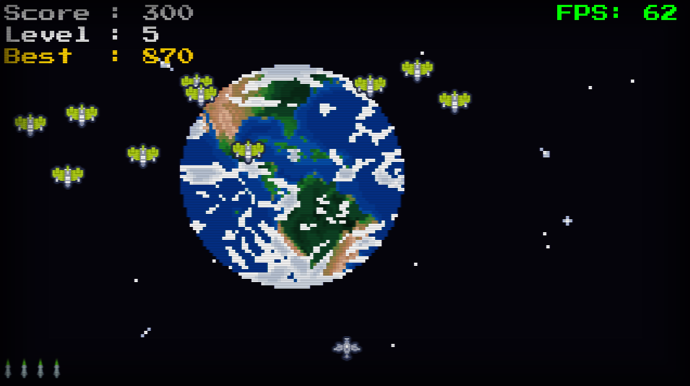

# Earth Invaders 
Earth Invaders is a high-fidelity, retro-style arcade shooter built with Python and Pygame. It features modern sub-pixel physics, a dynamic difficulty system, and an authentic CRT monitor simulation including scanlines, vignettes, and chromatic aberration.

 ## Controls
 * Left / Right Arrow Keys: Move your spaceship.
 * Spacebar: Fire missiles.
 * R Key: Restart the game after "Earth Has Fallen".
## Features
 * CRT Simulation: High-performance post-processing layer including horizontal scanlines and a darkened vignette for a 1980s tube-monitor look.
 * Sub-Pixel Movement: Physics calculated using floating-point math for smooth movement at high resolutions, independent of frame rate.
 * Persistent High Scores: Your best score is automatically saved to a local file.
## Installation
 * Prerequisites: Ensure you have Python 3.x and Pygame installed.
   pip install pygame

 * Run the Game:
   python game.py

## Technical Details
 * Resolution: 1280x720 (16:9 Aspect Ratio).
 * Target FPS: 60 FPS.
